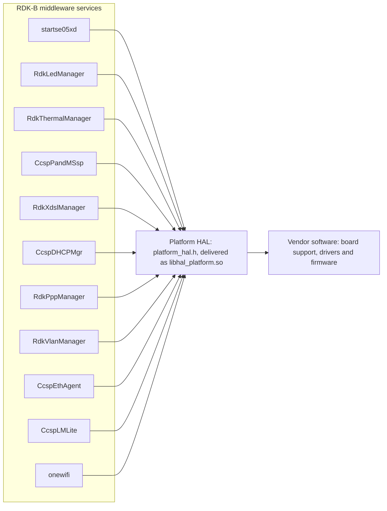
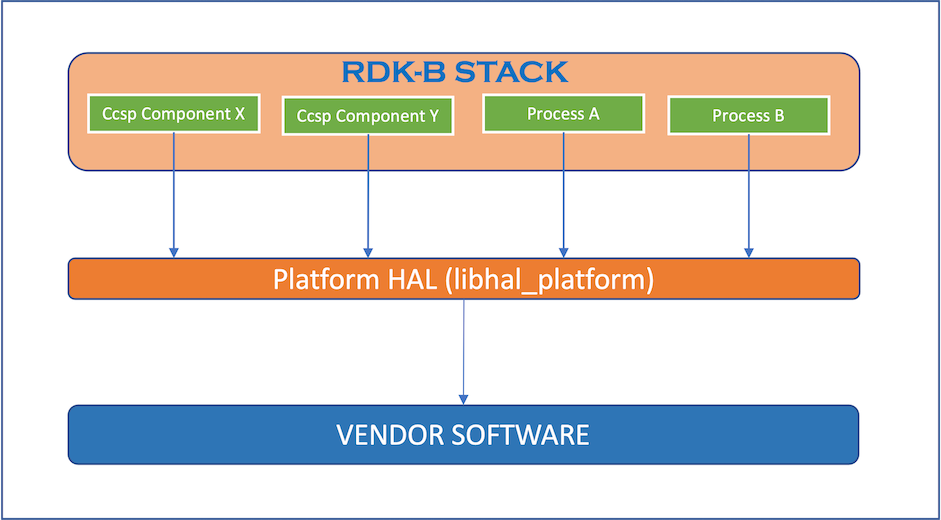
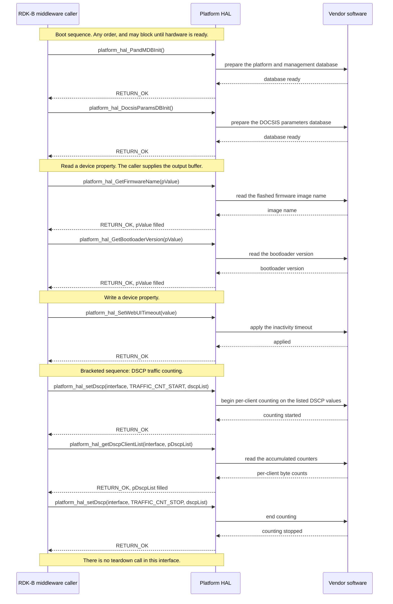

# PLATFORM HAL Documentation

## Version History

| Date | Comment | Version |
| --- | --- | --- |
| 2023-11-08 | Initial Platform HAL interface release under RDKB-52300. | 1.0.0 |
| 2023-11-13 | Repository housekeeping only; the declared interface did not change. | 1.0.1 |
| 2023-11-20 | DHCP option defines extended; header updated for the unified WAN manager under RDKB-52640. | 1.1.0 |
| 2023-12-28 | ECO mode status read added under RDKBDEV-2326. | 1.2.0 |
| 2024-11-25 | PPP username and password reads added under RDKBDEV-2733. | 1.2.1 |
| 2024-11-27 | QoS and traffic management added through `platform_hal_qos_apply`. | 1.3.0 |
| 2024-11-29 | Major version check aligned to `main` under issue #11; `build_ut.sh` updated. | 1.3.1 |
| 2024-11-29 | `platform_hal.h` corrected under issue #23. | 1.3.2 |
| Not stated in the repository changelog | Return value extended for unsupported HAL functions through `RETURN_UNSUPPORTED`, and the thermal manager functions implemented for XB10 and XB9, under RDKB-65287. | 1.3.3 |
| 2026-08-24 | Specification rewritten to the canonical RDK-B HAL topic set. Documentation only: the interface itself is unchanged, so this revision introduces no new release. | 1.3.3 (documentation revision) |

## Acronyms

- `HAL` \- Hardware Abstraction Layer
- `RDK-B` \- Reference Design Kit for Broadband Devices
- `OEM` \- Original Equipment Manufacturer
- `SoC` \- System on a Chip
- `DOCSIS` \- Data Over Cable Service Interface Specification
- `DRAM` \- Dynamic Random Access Memory
- `DSCP` \- Differentiated Services Code Point
- `eMMC` \- embedded MultiMediaCard
- `ECO` \- Energy Conservation Operation, the device power-saving mode
- `LED` \- Light Emitting Diode
- `MACsec` \- Media Access Control Security
- `PandM` \- Platform and Management, the RDK-B provisioning and management database
- `PPP` \- Point-to-Point Protocol
- `PSM` \- Power Saving Mode
- `PWM` \- Pulse Width Modulation
- `QoS` \- Quality of Service
- `RPM` \- Revolutions Per Minute
- `SNMP` \- Simple Network Management Protocol
- `WAN` \- Wide Area Network

*Source: the terms used in this document, expanded against `include/platform_hal.h`.*

## Description

Platform HAL is the RDK-B abstraction over board and device details that belong to no single
subsystem. It is the interface through which RDK-B middleware reads hardware and firmware
identity such as the model name, serial number, base MAC address, hardware revision, software
version, bootloader version and firmware image name; reads flash and DRAM sizing; toggles remote
management surfaces such as Telnet, SSH, SNMP and the web user interface; drives LED, fan and
thermal control; and applies QoS, DSCP traffic counting and MACsec settings. The vendor supplies
the implementation behind it; the interface itself declares no implementation.

Platform HAL has the widest set of dependents of any HAL in this collection. Eleven RDK-B
middleware services reach the hardware through this one interface, so the interface is a fan-in
rather than the single service-to-HAL chain most RDK-B HALs form.


The diagram below describes a high-level software architecture of the Platform HAL module stack.



This raster is re-audited against the interface whenever this topic changes.

## Optional Components

Every function in this interface is declared unconditionally except the nine gated by the two
compile-time feature flags below. A caller compiled against a header where a flag is undefined
will not see the corresponding declarations at all, so the availability of these functions is a
build-time property rather than a run-time one.

- `FEATURE_RDKB_LED_MANAGER` gates exactly one function,
  `platform_hal_initLed()`. It additionally gates the
  `led_name` and `led_param` members of
  `LEDMGMT_PARAMS`, so the structure a caller populates for
  `platform_hal_setLed` differs in shape between the two builds.
- `FEATURE_RDKB_THERMAL_MANAGER` gates eight functions:
  `platform_hal_initThermal()`,
  `platform_hal_LoadThermalConfig()`,
  `platform_hal_setFanSpeed()`,
  `platform_hal_getFanTemperature()`,
  `platform_hal_getInputCurrent()`,
  `platform_hal_getInputPower()`,
  `platform_hal_getRadioTemperature()` and
  `platform_hal_getEcoModeStatus()`. It also gates the types
  `FAN_SPEED`,
  `THERMAL_PLATFORM_CONFIG` and
  `FAN_ERR`.

**The gating is deliberately asymmetric, and a caller must not generalise from the names.** The
LED functions `platform_hal_setLed` and `platform_hal_getLed` are unconditional; only
`platform_hal_initLed` is gated. The fan readings `platform_hal_getFanSpeed`,
`platform_hal_getRPM`, `platform_hal_getRotorLock` and `platform_hal_getFanStatus`, and the
override `platform_hal_setFanMaxOverride`, are all unconditional even though they concern the same
hardware as the gated thermal block; `platform_hal_setFanMaxOverride` is declared two lines above
the `FEATURE_RDKB_THERMAL_MANAGER` guard.

## Component Runtime Execution Requirements

### Initialization and Startup

The initialization functions below give the vendor implementation the opportunity to open the
databases it needs, start any internal threads and prepare the hardware. The client is expected to
call them during the boot sequence, and **this interface places no ordering constraint between
them: they may be called in any order.**

- `platform_hal_PandMDBInit()`
- `platform_hal_DocsisParamsDBInit()`
- `platform_hal_initThermal()` \- declared only when
  `FEATURE_RDKB_THERMAL_MANAGER` is defined, so a build without that flag has a two-call
  initialization sequence

Third-party vendors implement these appropriately to meet operational requirements. **This
interface is expected to block if the hardware is not ready.** A caller must therefore treat
initialization as a call that may take an indeterminate time rather than one that returns
promptly.

`platform_hal_initLed()` is an initialization call for the LED
subsystem specifically rather than part of the boot sequence above. It is declared only when
`FEATURE_RDKB_LED_MANAGER` is defined, it reports the path of the vendor's LED configuration file,
and its own documentation directs a caller that receives `RETURN_ERR` from it to treat the LED
subsystem as unavailable and not to call the other LED functions. That is the one initialization
dependency this interface states.

### Threading Model

**The interface is not thread safe.**

Any module which is invoking the API should ensure calls are made in a thread safe manner. Every
function in this interface repeats that obligation on its own declaration: a caller must serialise
each call against every other Platform HAL call it makes.

This statement is specific to Platform HAL and is deliberately not aligned with sibling HALs that
declare themselves thread safe. It is the policy this repository states, and it is what the
per-function documentation in `include/platform_hal.h` is written against.

Different third-party vendors are allowed to create internal threads to meet their operational
requirements. In that case the third-party implementation is responsible for synchronizing between
the calls and events and for cleaning up the thread.


### Process Model

All functions in this interface are expected to be called from multiple processes. The two classes
of caller are visible in the architecture diagram under **Description**: RDK-B `Ccsp` components
and processes that are not `Ccsp` components. Because the interface is not thread safe and offers
no cross-process locking of its own, a vendor implementation must protect any shared platform
resource it touches against concurrent entry from more than one process.

### Memory Model

All strings this interface exchanges are zero-terminated. Every output buffer documented in
`include/platform_hal.h` is described as receiving a zero-terminated value, and the buffer minimum
sizes are stated per function on the declaration.

#### Caller Responsibilities

- The client is responsible for allocating and de-allocating memory for the functions that
  require it, as specified in the API documentation on each declaration.
- Where a function documents a minimum buffer size, the caller must honour it. This interface
  defines no length argument and no truncation behaviour for its string outputs, so a caller that
  supplies a shorter buffer has no defined protection against an overrun.
- Where a structure is passed in, the caller allocates it, populates it fully and owns it. **This
  interface does not state whether an implementation retains a caller-supplied pointer once the
  call has returned**, so a caller keeps the structure valid for the duration of the call, must not
  rely on the pointer being discarded when the call completes, and must confirm the retention
  behaviour with the vendor implementation before handing this interface storage it is about to
  release.
- The same silence governs *erasing* that storage, and the order of the two obligations matters.
  Where a buffer or structure holds a protected value, the clearing requirement under `Logging and
  debugging requirements` is discharged **after** non-retention or release has been established for
  that storage, not when the call returns — overwriting memory an implementation may still be
  reading corrupts that read. Keeping the storage stable and then erasing it are sequential steps,
  not competing rules, and the erasure follows immediately once the first is settled. This applies
  to a caller-allocated **output** buffer as much as to an input structure: every string accessor
  in this interface describes its output as caller-allocated and caller-owned and states that
  retention is not established, so the return of the call is not the moment the buffer becomes free
  to overwrite. A copy the caller made for itself is the exception, because no implementation holds
  a pointer to it.
- One function inverts this and the caller must not miss it:
  `platform_hal_GetMemoryPaths()` allocates a
  `PLAT_PROC_MEM_INFO` array itself and returns it through a
  caller-held pointer, rather than filling a caller-supplied buffer.

#### Module Responsibilities

- Third-party vendors are allowed to allocate memory for their internal operational requirements.
  In that case the third-party implementation is responsible for de-allocating it internally.
- A module must release all internally allocated memory when it terminates or closes its
  connection to the HAL, so that no resource is leaked across a service restart.
- Whether a module may retain a caller-supplied pointer beyond the call that carried it is not
  stated anywhere in this interface. Neither the header nor the earlier revision of this
  specification places that obligation on an implementation, so this document does not either: a
  module that retains such a pointer contradicts nothing stated here, which is why the
  caller-side guidance above is written conservatively rather than as a guarantee.

### Power Management Requirements

The HAL is not involved in any of the power management operation. Any power management state
transitions MUST not affect the operation of the HAL.

Two functions in this interface concern power state as *data* and do not make the HAL a
participant in power management. `platform_hal_SetLowPowerModeState()`
carries a `PSM_STATE` value, and
`platform_hal_getEcoModeStatus()` reports the ECO mode status
of a radio module. Both report or set data-model state only.

### Asynchronous Notification Model

There are no asynchronous notifications.

This interface declares no function-pointer typedef and no callback registration function, so
there is no mechanism by which a vendor implementation could notify a caller of an event. Every
value a caller needs is obtained by calling a function and reading its output. A caller that needs
to observe a changing quantity, such as a temperature or an interface counter, must poll it.


### Blocking calls

**Synchronous:** every function in this interface operates synchronously. The calling thread is
blocked until the operation completes, and each declaration in `include/platform_hal.h` states
this on its own Doxygen `execution` line.

**No published time bound:** **this interface publishes no numeric timeout or completion time for
any of its functions.** That is stated per function in the header rather than left implicit. A
caller must therefore not assume a bound, and a caller that needs one must impose its own timeout
around the call and decide for itself how to treat a call that has not returned.

**Calls known to take longer:** `platform_hal_StartMACsec()`
 take an explicit timeout argument and wait for the outcome, and initialization is expected to block while the hardware is
not ready. These are the calls a caller should expect to hold a thread longest.

### Internal Error Handling

All Platform HAL functions that report status do so synchronously, as the return value. The HAL is
responsible for handling system errors, such as an out-of-memory condition, internally.

Three status codes are defined, and the set a caller must handle differs by function.

- `RETURN_OK`, value 0 \- the operation completed
  successfully.
- `RETURN_ERR`, value -1 \- the operation failed. This
  interface reports no more specific cause, so a caller should discard any output, and retry or
  report the failure.
- `RETURN_UNSUPPORTED`, value -2 \- the platform does not
  implement the function. It is returned by exactly six functions, all inside the
  `FEATURE_RDKB_THERMAL_MANAGER` block: `platform_hal_setFanSpeed`,
  `platform_hal_getFanTemperature`, `platform_hal_getInputCurrent`, `platform_hal_getInputPower`,
  `platform_hal_getRadioTemperature` and `platform_hal_getEcoModeStatus`. Unlike `RETURN_ERR` this
  outcome is permanent for the platform, so a caller should stop polling rather than retry.

Four functions do not participate in this scheme at all, and treating their return value as a
status code is an error:

- `platform_hal_getRotorLock()` returns its own discrete codes
  \- 1 for a locked rotor, 0 for an unlocked rotor, and -1 where the platform or the selected fan
  provides no rotor lock indication. The -1 case means "unknown", not "not locked", and must not
  be read as a generic failure even though it shares the numeric value of `RETURN_ERR`.
- `platform_hal_getFanSpeed()`,
  `platform_hal_getRPM()` and
  `platform_hal_getFanStatus()` return a reading or a state
  rather than a status code, and **this interface defines no distinguished value by which any of
  them signals failure.** A caller consequently cannot separate a genuine reading of 0, or a
  disabled fan, from a failed query. That is a property of the interface, not an omission in this
  document, and a caller that needs to detect failure on these three must obtain corroboration
  elsewhere.

### Persistence Model

There is no requirement for the HAL to persist any setting information. The caller is responsible
for persisting any settings related to its own implementation.

## Non functional requirements

The following non functional requirements should be supported by the component.

### Logging and debugging requirements

The component is required to log all error and critical informative messages that help to debug
and triage issues and to understand the functional flow of the system. Logging should use the
`syslog` mechanism, which suits system-level software; the use of `printf` is discouraged unless
`syslog` is unavailable. Logging should be consistent across all HAL components.

**This interface does not fix a vendor log file name or a log directory.** Neither
`include/platform_hal.h` nor this repository names one, so no name and no path is asserted here.
A vendor implementation that logs to a file must agree the name and location with the integrator
rather than inferring either from a sibling HAL, whose file names are specific to that HAL.

Log levels follow Linux standard logging. Entries should be categorised by the levels below,
listed in descending order of severity:

- **FATAL:** critical conditions, typically indicating a crash or a severe failure requiring
  immediate attention.
- **ERROR:** non-fatal error conditions that nonetheless significantly impede normal operation.
- **WARNING:** potentially harmful situations that are not yet errors.
- **NOTICE:** important events that are not errors.
- **INFO:** general informational messages describing normal operation.
- **DEBUG:** detailed information useful when diagnosing a problem.
- **TRACE:** fine-grained logging that traces internal flow.

Each entry should carry a timestamp, the log level and a message describing the event or
condition, so that log files can be parsed consistently across vendors and components.

Two properties of this interface make logging materially more important here than the general
requirement suggests. `RETURN_ERR` reports no cause, so the log is the only place a cause can be
recorded; and `platform_hal_getFanSpeed`, `platform_hal_getRPM` and
`platform_hal_getFanStatus` have no failure value at all, so a failed query on those three is
invisible to the caller and must be logged by the implementation if it is to be diagnosable.

**Credentials and device identifiers must not be logged.** Nine of the seventy-one entry points in
this interface move material that must never reach a log, through fourteen declared values in eight
groups, and the requirements below are normative rather than advisory: they bind the vendor
implementation and the RDK-B caller equally. They are stated here because the interface declares no
redaction helper and no secure-buffer type, so nothing enforces them mechanically.

- **The protected values, named exactly.** The table below is that set in full, derived member by
  member from the declarations and structure definitions in
  `include/platform_hal.h` rather than from the accessor
  briefs, because a brief says what a call is for while the definition is what crosses the boundary. The term **protected
  value** means, everywhere below, any value this table names — the rules that follow are written
  against the term rather than against a shorter list, so that they cannot drift from it. 

  | Protected value | Where it is declared, and the call that moves it | Why it is protected |
  | --- | --- | --- |
  | The `PPP` password | The `pPassword` output of `platform_hal_GetPppPassword()`. | A `WAN` access credential. The pair authenticates the device to the operator's network, so disclosure of either half narrows an attack on the other and disclosure of both is complete. |
  | The `PPP` user name | The `pUserName` output of `platform_hal_GetPppUserName()`. | The other half of that pair. A known user name reduces the credential to a single unknown, which is why it is protected to the same standard as the password. |
  | The device serial number | The `pValue` output of `platform_hal_GetSerialNumber()`. | A unit-unique identifier that links a device to a subscriber record, and personal data in that context. |
  | The base `MAC` address | The `pValue` output of `platform_hal_GetBaseMacAddress()`. | The address from which every interface address on the unit is derived, so it identifies the device on any network it reaches; its leading octets also disclose the vendor. |
  | The `CMTS` `MAC` address | The `pValue` output of `platform_hal_getCMTSMac()`. | The hardware address of the headend this device is registered to. It places the subscriber within a named segment of the operator's access network, which is topology a reader of a log should not acquire. |
  | `hal_network_params_t` `src_mac`, the `src_ip` union's `ipv4` and `ipv6`, and the `dest_ip` union's `ipv4` and `ipv6` | Populated by the caller and passed in to `platform_hal_qos_apply()`. | The endpoints of a live flow: the source identifies a device on the subscriber's network and the destination identifies what it was communicating with, so the pair records who contacted whom. These are protected on the way in exactly as the others are on the way out — the caller that assembled the structure can disclose it as easily as the implementation that receives it. |
  | `dhcp_opt_list` `dhcp_opt_val`, where the option it belongs to carries an identifier or an address | Returned by `platform_hal_GetDhcpv4_Options()` and `platform_hal_GetDhcpv6_Options()`. | An option value whose content this interface does not describe. The codes listed on `dhcp_opt`include `DHCPV4_OPT_61` and `DHCPV4_OPT_122`, which carry a client identifier and address material respectively, so a value under one of those codes is protected. A caller that cannot establish which code a node holds treats the value as protected. |
- **No protected value, and no fragment, hash or length of one, is written at any severity.**
  Neither an implementation nor a caller may write a protected value — whole, truncated, prefixed,
  suffixed, first-and-last character, encoded, encrypted, hashed, or reduced to a character count or
  a checksum — to `syslog`, to a `printf` fallback, to standard output, to standard error, to a
  vendor log file, to a trace or debug stream, or to any error or exception message it constructs or
  propagates. This holds at every level of the ladder above, `DEBUG` and `TRACE` included: a value
  too sensitive for `INFO` is not made acceptable by lowering the severity, and a verbose or debug
  build is not a build in which these values may be logged. It holds for the caller as much as for
  the implementation: a credential is just as exposed by the middleware that read it as by the `HAL`
  that returned it.
- **Redact with one fixed marker; do not truncate, hash or count.** A diagnostic that has to record
  which accessor failed names the accessor and substitutes the single fixed redaction marker
  `[REDACTED]` for the value — the same marker for every protected value in the table above,
  whichever one it stands for, and of a length unrelated to the value it replaces,
  so that the marker itself discloses neither the content nor the shape of what it hides. A prefix,
  a suffix, a first-and-last character, a hash, a checksum and a length are each not redaction: a
  length alone distinguishes one credential format from another, a `MAC` prefix discloses the
  vendor, and a hash of a serial number is a stable identifier for the unit that produced it. The
  same reasoning carries to the values added above. An address space small enough to sweep — a
  48-bit `MAC` address, a 32-bit IPv4 address — makes a digest of one recoverable by enumeration,
  so a hash is not a redaction of an address either; the first three octets of any of the three
  `MAC` addresses name the vendor; and a byte count published against a redacted client is still
  that client's usage if the redaction is not identical for every client in the array.
- **Every protected value is excluded from crash artefacts, support bundles and telemetry.** A core
  dump, a minidump, a stack dump, a heap dump, a post-mortem or exception report, and a support or
  bug-report bundle must not carry any value the table above names — either credential, the serial
  number, any of the three `MAC` addresses, a client `MAC` with its counters, a flow's source or
  destination address, or a protected `DHCP` option value — whole, in fragment, hashed or reduced
  to a length; neither may any telemetry, analytics, metric, metric label or usage report. A
  per-client traffic metric is the case most easily overlooked, because a metric labelled with a
  client `MAC` address discloses the address as surely as a log line would. This is a separate
  obligation from the logging rule and it fails separately — an implementation with disciplined logging still
  discloses everything if it uploads an unfiltered core or labels a metric with the device serial
  number. Where a platform's crash handler cannot be constrained, the value must not be resident
  when an artefact can be taken, which is what the clearing rule below achieves.
- **Clear after use, sequenced after retention, and only what the caller owns.** A protected value
  is not left in reusable memory — and the *order* in which it is removed is part of the
  requirement rather than a detail, because this interface states on every affected declaration
  that whether the implementation keeps a caller-supplied pointer after the call returns is not
  established (see `Memory Model`), and overwriting storage an implementation may still be reading
  corrupts that read. Three cases, and they differ:
  - *A copy the caller made for itself* — a credential copied into a local, a `MAC` address copied
    out of a client entry, an address copied out of a flow description — is the caller's alone. No
    implementation holds a pointer to it, so it is overwritten as soon as the caller is done with
    it, with nothing to establish first.
  - *Storage the caller handed across the boundary* is the case the old wording got the wrong way
    round. The buffers passed to `platform_hal_GetPppPassword()`,
    `platform_hal_GetPppUserName()`, `platform_hal_GetSerialNumber()`,
    `platform_hal_GetBaseMacAddress()` and `platform_hal_getCMTSMac()`, the
    `DSCP_list_t` allocated for `platform_hal_getDscpClientList()` to fill, and the
    `hal_network_params_t` assembled for `platform_hal_qos_apply()` — the last two of
    which hold addresses after the call as surely as before it — each stay allocated, unmoved and
    unmodified until non-retention, release or the completion of any asynchronous use has been
    established for them. Under this interface that means an explicit statement from the
    implementation being integrated, since no declaration provides one. Erasure then follows
    immediately, not at a later convenience.
  - *An original whose owner is unknown* is not the caller's to erase or release at all. The
    `dhcp_opt_list` nodes returned by `platform_hal_GetDhcpv4_Options()` and
    `platform_hal_GetDhcpv6_Options()` and the
    `PLAT_PROC_MEM_INFO` array that
    `platform_hal_GetMemoryPaths()` allocates have no stated owner, so a caller copies
    what it needs, protects the copy and erases the copy.

  All of this holds on the failure path, where a caller-allocated buffer may hold part of a value.
  What a caller must not do there is read an undefined output, or dereference, clear or free a
  pointer the call may never have set: a failed call defines neither. And a protected value is not
  copied into a longer-lived home — a data-model cache, a configuration file, an environment
  variable, a message queue, a retry buffer, a `URL` or a filename — nor passed to a component
  that has no need of it.
- `RETURN_ERR` **reports no cause, and that does not license logging the value.** Where one of the
  nine calls in the table above fails, the diagnostic records the call and the outcome, never the
  output contents — which on failure are undefined in any case, so what would be logged is as
  likely to be a fragment of a previous value as anything else. This applies to the structured
  outputs as much as to the string ones: on a failed
  `platform_hal_getDscpClientList()` neither the client array nor `numClients` is
  defined, so neither may be read for a diagnostic, and on a failed
  `platform_hal_GetDhcpv4_Options()` or
  `platform_hal_GetDhcpv6_Options()` the returned list pointers are not defined and
  must not be walked to describe what went wrong.
- **What may be logged, stated positively.** The identity of the call, the `RETURN_OK` or
  `RETURN_ERR` it returned, the `WAN_INTERFACE` and
  `TRAFFIC_CNT_COMMAND` selectors, the `dscp_value`and
  `numClients` members of an element with the `numElements`
  count above them, the `ip_version`, `src_port`
  , `dest_port` , `protocol`
  and `dscp_value` members of a flow description, and the `dhcp_opt` code
  without its value are none of them protected values, and recording them
  with the timestamp and level the format above requires is
  the intended way to make a failure diagnosable without disclosure. Two qualifications: a port and
  a protocol identify a service rather than a person only while they are not published beside the
  addresses of the same flow, since the complete tuple is the record the row above protects; and a
  count is not an exemption from the redaction rule — the number of clients in an array may be
  logged, the length of a credential or an address may not.
- **The interface guarantees none of this.** It declares no scrubbing function, no opaque credential
  type and no flag by which a caller could ask an implementation to suppress its own logging, and it
  provides no way to verify that an implementation observes these rules. A caller integrating a
  vendor implementation must establish compliance by inspection or by contract rather than assume
  it, and must treat the absence of these values from a vendor log, core or telemetry feed as
  unverified until it has done so.

### Memory and performance requirements

The component should not contribute disproportionately to memory or CPU utilization while
performing normal operations, and its consumption should be commensurate with the operation
requested.

**No memory footprint limit is specified for this interface.** No numeric limit on resident
memory, on allocation size or on CPU utilization is declared by `include/platform_hal.h` or
anywhere else in this repository, so none is stated here and a caller must not assume one.

Two bounded costs are declared and are the figures a caller can size against. The fixed-capacity
output structure `DSCP_list_t` holds up to 64
`DSCP_Element_t` entries, each holding up to 256
`Traffic_client_t` entries, and the caller allocates the
whole structure including both arrays; that single allocation dominates the memory cost of this
interface. And every string output has a per-function documented minimum buffer size.

### Quality Control

The Platform HAL implementation should pass `Coverity`, `Black Duck` and `Valgrind` checks without
any issue. No memory leak or memory corruption should be introduced by the HAL or by the
underlying third-party software implementation.

### Licensing

The Platform HAL implementation is expected to be released under the Apache License 2.0. The
licence text delivered with this repository is reachable from this documentation set as its
licence and copying pages, with the attribution notice as its notice page. All three are listed
under the generated site's related pages and are delivered at the repository root.

### Build Requirements

The source code should be built under the Linux Yocto environment and should be delivered as a
shared library named `libhal_platform.so`.

To use the Platform HAL capabilities from a component or process:

1. Include `platform_hal.h`, which carries all function prototypes and datatype definitions for
   this interface.
2. Add a linker dependency on `libhal_platform.so`.


### Variability Management

Any new function introduced into this interface should be implemented by all third-party modules,
and the RDK generic code should be compatible with a specific version of the HAL software.

Each interface is versioned using [Semantic Versioning 2.0.0](https://semver.org/spec/v2.0.0.html), and the vendor
code complies with a specific version of the interface. Note the limitation recorded under
**Version History**: the version applies to the released interface, and this header declares no
version macro, so the version cannot be tested from code.


### Platform or Product Customization

The product can be configured through the following compile-time defines:

```c
FEATURE_RDKB_LED_MANAGER
FEATURE_RDKB_THERMAL_MANAGER
```

The effect of each flag on the declared surface is enumerated under **Optional Components**,
including the asymmetry that leaves the fan readings and the two non-initializing LED functions
unconditional. Beyond these two flags, product variation is carried in the *values* this interface
reports rather than in its shape: the model name, router region, hardware version, factory partner
identifier and factory cable-modem variant are all read through it, and the LED colour set, the
fan count and the thermal thresholds are all documented as vendor or OEM specific.

The RDK-B repository inventory records an upstream intention to move the thermal and LED functions
into HALs of their own. That is an intention recorded upstream, not a property of the interface as
delivered here: both function families are declared in `platform_hal.h` in this release, and this
document describes them as part of this interface.


## Interface API Documentation

All function prototypes and datatype definitions for this interface are declared in
`include/platform_hal.h`, and the per-function reference \- argument ranges, buffer ownership and
minimum sizes, pre-conditions, post-conditions, every return value and its meaning, blocking
behaviour and thread safety \- is carried in the Doxygen comment on each declaration. The topics
below index that surface and state the concepts a caller needs in order to read it.

### Theory of operation and key concepts

Platform HAL is a flat, stateless-to-the-caller function interface. There is no handle, no session
and no object a caller creates or destroys. A caller includes the header, links the library,
performs the boot-time initialization calls, and thereafter calls individual functions that each
read or set one platform property. Almost every function is a getter or a setter over a single
quantity; the exceptions are the DSCP traffic-counting group, which accumulates counters between a
start and a stop, and the MACsec group, which starts and stops a protocol on a port.

The interface divides into two behavioural kinds, and the distinction matters more than the
functional grouping does:

- **Status-reporting functions** return `RETURN_OK`, `RETURN_ERR` or, for six thermal functions,
  `RETURN_UNSUPPORTED`, and deliver their result through an output argument. Sixty-seven of the
  seventy-one functions are of this kind.
- **Value-returning functions** return the reading itself and have no separate status channel.
  These are `platform_hal_getFanSpeed`, `platform_hal_getRPM`, `platform_hal_getFanStatus` and
  `platform_hal_getRotorLock`. Only the last of these defines a value meaning "not applicable";
  the other three define no failure value at all. See **Internal Error Handling**.

#### Object Lifecycles

- **Creation.** This interface creates nothing on the caller's behalf and exposes no object
  identity. The three boot-time initialization functions prepare vendor-internal state; they
  return no handle, and nothing a caller holds refers to that state.
- **Usage.** The caller allocates the structures the interface fills \-
  `LEDMGMT_PARAMS`,
  `THERMAL_PLATFORM_CONFIG`,
  `FW_BANK_INFO`,
  `INTF_STATS`,
  `DSCP_list_t`,
  `hal_network_params_t` \- and owns them for their whole
  lifetime. The implementation reads or fills them during the call; whether it retains the pointer
  afterwards is not stated by this interface, so a caller keeps each structure valid for as long as
  it uses this interface rather than assuming the pointer is discarded when the call returns.
- **Destruction.** The caller de-allocates what it allocated. **There is no teardown,
  deinitialization or close function in this interface**, so the vendor-internal state established
  at initialization persists for the lifetime of the process and is not releasable through this
  interface. A caller must not look for a counterpart to the initialization calls.
- **The one exception to caller allocation.**
  `platform_hal_GetMemoryPaths()` allocates a
  `PLAT_PROC_MEM_INFO` array and returns it through a
  caller-held pointer. Its declaration documents this asymmetry explicitly.
- **Identifiers.** The interface addresses hardware by small integer index rather than by object
  identity: a fan index, an Ethernet port number, a radio index, an LED index bounded by
  `LED_BUFFER_SIZE`, a processor selected by
  `RDK_CPUS`, a firmware bank selected by
  `FW_BANK` and a WAN interface selected by
  `WAN_INTERFACE`.

#### Method Sequencing

- **Initialization first.** The boot-time initialization calls listed under **Initialization and
  Startup** are made during the boot sequence, and **they may be made in any order**. This
  interface establishes no order among them.
- **Which functions depend on which initialization call is not established by this interface.**
  The initialization calls exist so that dependent functions can work, but neither the header nor
  this repository states which function depends on which initialization call. A caller must
  therefore perform the full initialization sequence for its build rather than infer a narrower
  dependency, and this document does not supply a dependency map, because none is established.
  The one dependency that *is* stated is the LED one: a `RETURN_ERR` from
  `platform_hal_initLed` means the other LED functions must not be called.
- **Paired sequences.** Three groups have an order of their own.
  `platform_hal_setDscp` with `TRAFFIC_CNT_START` begins traffic counting, and
  `platform_hal_getDscpClientList` reads the accumulated counters, which
  `platform_hal_resetDscpCounts` clears and `platform_hal_setDscp` with `TRAFFIC_CNT_STOP` ends.
  `platform_hal_StartMACsec` and `platform_hal_StopMACsec` bracket MACsec operation on a port,
  with `platform_hal_GetMACsecOperationalStatus` reporting the achieved state as against the
  administrative setting read by `platform_hal_GetMACsecEnable`.
  `platform_hal_LoadThermalConfig` supplies the default thresholds a caller may then apply.
- **Everything else is order-independent** once initialization has completed, subject only to the
  serialisation the **Threading Model** requires.

#### State-Dependent Behavior

- **Configuration progress.** `platform_hal_GetDeviceConfigStatus()`
  reports how far the device has progressed through its configuration sequence, returning one of
  the tokens `WaitForImplement`, `In Progress` or `Complete`. A caller uses it to decide whether
  configuration-dependent work may proceed.
- **Administrative against operational state.** `platform_hal_GetMACsecEnable` reports the
  administrative setting and `platform_hal_GetMACsecOperationalStatus` reports whether MACsec is
  actually configured at the interface or driver level. The two can legitimately disagree, and a
  caller that needs the truth about the link must read the operational one.
- **Readings change with hardware state.** The fan, temperature, current, power and interface
  statistics functions return values that depend on the platform's condition at the time of the
  call. `platform_hal_GetInterfaceStats` in particular does not specify the point from which its
  counters accumulate, so successive reads must be differenced.
- **Build state changes the surface.** Nine functions are absent from the declared surface when
  their feature flag is undefined, and six thermal functions may report `RETURN_UNSUPPORTED` at
  run time even when declared. Both are enumerated under **Optional Components**.
- **Transitions are not specified.** The values above are states a caller can observe; this
  interface does not define which transitions between them are legal or in what order they occur.
  See **State Diagram**.


### Data Structures and Defines

The types below are the ones a caller must construct or interpret, because they appear in the
signatures of this interface. Each is declared in `include/platform_hal.h`.

**Status codes.** Returned by the sixty-seven status-reporting functions; see **Internal Error
Handling** for which function returns which.

| Define | Value | Meaning |
| --- | --- | --- |
| `RETURN_OK` | 0 | The operation completed successfully. |
| `RETURN_ERR` | -1 | The operation failed; no cause is reported. |
| `RETURN_UNSUPPORTED` | -2 | The platform does not implement the function. Permanent; six thermal functions only. |

**Primitive type aliases.** This interface expresses its signatures in aliases rather than in the
underlying C types, so a caller reading a declaration needs them:
`CHAR` for `char`,
`UCHAR` for `unsigned char`,
`BOOLEAN` for `unsigned char` carrying
`TRUE` or `FALSE`,
`INT` for `int`,
`UINT` for `unsigned int`,
`ULONG` for `unsigned long`, and the fixed-width aliases
`UINT8_t`,
`UINT16_t`,
`UINT32_t` and
`UINT64_t`.
`ENABLE` is also defined, and its own comment records that no
declaration in the header refers to it.

**Buffer and capacity limits.** `FW_NAME_MAX_LEN` 64 and
`FW_STATE_MAX_LEN` 64 size the firmware bank strings;
`PLAT_PROC_MEM_MAX_LEN` 40 sizes each memory path string;
`LED_BUFFER_SIZE` 3 is the number of LED entries a caller
may address. Functions that write a string into a caller buffer state their own minimum size on
the declaration rather than through a macro.

**DHCP option codes.** `DHCPV6_OPT_3` onwards and the
DHCPv4 set ending at `DHCPV4_OPT_END`, value 255, are the
codes carried in the `dhcp_opt` member of `dhcp_opt_list`. `DHCPV4_OPT_END` is the sentinel used
to check whether an option is valid.

**Enumerations and structures.** 

| Type |  What it represents |
| --- |  --- |
| `RDK_CPUS` |  Processor selector: `HOST_CPU`, `PEER_CPU`, `NOT_SUPPORTED_CPU`. Argument to `platform_hal_GetMemoryPaths`. |
| `PLAT_PROC_MEM_INFO` |  DRAM and three eMMC storage paths for one processor, each bounded by `PLAT_PROC_MEM_MAX_LEN`. Allocated by the HAL, not by the caller. |
| `LED_COLOR` |  LED colour selector, from `LED_WHITE` through the combined colours to `NOT_SUPPORTED`. |
| `LEDMGMT_PARAMS` | LED configuration: colour, state \- solid or blink \- and blink interval in seconds. Its `led_name` and `led_param` members exist only when `FEATURE_RDKB_LED_MANAGER` is defined. |
| `FAN_SPEED` | Discrete fan speed setting: `FAN_SPEED_OFF`, `FAN_SPEED_SLOW`, `FAN_SPEED_MEDIUM`, `FAN_SPEED_FAST`, `FAN_SPEED_MAX`. Thermal flag only. |
| `THERMAL_PLATFORM_CONFIG` | Platform fan configuration: fan count, the three temperature thresholds, minimum run time, monitoring delay, power monitoring and log interval. Thermal flag only. |
| `FAN_ERR` | Fan operation error state: `FAN_ERR_NONE`, `FAN_ERR_HW`, `FAN_ERR_MAX_OVERRIDE_SET`. Thermal flag only. |
| `dhcp_opt_list` | Singly linked list node carrying one DHCPv4 or DHCPv6 option code and its value. |
| `PSM_STATE` | Power saving mode state: `PSM_UNKNOWN`, `PSM_AC`, `PSM_BATT`, `PSM_HOT`, `PSM_COOLED`, `PSM_NOT_SUPPORTED`. Data-model state only. |
| `WAN_INTERFACE` | WAN interface selector for DSCP traffic counting: `DOCSIS`, `EWAN`. |
| `TRAFFIC_CNT_COMMAND` | Start or stop selector for DSCP traffic counting: `TRAFFIC_CNT_START`, `TRAFFIC_CNT_STOP`. |
| `Traffic_client_t` | Byte counters for one client against a single DSCP value, with the client MAC address. |
| `DSCP_Element_t` | One DSCP value with its client count and a fixed array of up to 256 client entries; only the first `numClients` are meaningful. |
| `DSCP_list_t` | Complete DSCP counting result for one WAN interface: up to 64 elements, of which only the first `numElements` are meaningful. |
| `FW_BANK` | Firmware bank selector: `ACTIVE_BANK`, `INACTIVE_BANK`. |
| `FW_BANK_INFO` | Firmware image name and trial-boot state for one bank, as zero-terminated strings. |
| `INTF_STATS` | Packet and byte counters for one network interface, covering LAN-to-WAN and WAN-to-LAN traffic only. |
| `ip_version_t` | IP version selector for QoS parameters: `IP_VERSION_IPV4`, `IP_VERSION_IPV6`. |
| `net_proto_t` | Transport protocol selector for QoS parameters: `PROTOCOL_TCP`, `PROTOCOL_UDP`. |
| `hal_network_params_t` | The QoS and traffic management parameter set: source and destination MAC and IP addresses, ports, protocol and DSCP value. |

Each of these types also carries a pointer alias where the interface uses one, for example
`PLEDMGMT_PARAMS`, `PPLAT_PROC_MEM_INFO`, `PPSM_STATE`, `PFW_BANK_INFO`, `PINTF_STATS`,
`pDSCP_list_t`, `pDSCP_Element_t` and `pTraffic_client_t`. The member-level meaning and the valid
range of every field are documented on the member itself in `include/platform_hal.h`.

**This interface declares no callback typedef and no callback registration function**, so there is
no notification type to document here. See **Asynchronous Notification Model**.

### API Surface

The complete declared surface of this interface is the seventy-one functions below, every one of
them named here by its exact identifier. Sixty-seven return `INT`,
two return `UINT`, one returns `BOOLEAN` and one returns lowercase `int`; **no function in this
interface returns `void`.** The nine functions marked *flag* are declared only when their feature
flag is defined, as set out under **Optional Components**.

This topic is the complete index. The generated Doxygen reference for this repository carries all
71, the nine marked *flag* included, because the documentation build predefines both feature flags
as recorded under **Build Requirements**.

**Where these pointers resolve.** The locators in this topic are relative paths into
`include/platform_hal.h`, the form this documentation set uses throughout, so they resolve on
GitHub and in a checkout \- the surface a developer using this repository reads. They do **not**
resolve from inside the generated documentation site: the generator copies each link target
verbatim into a page one directory below this file, so a site served with `docs/output/html` as its
root has nothing above that root to reach and answers `404`, and opened from the filesystem the
same target does not exist. Follow a source pointer on GitHub or in a checkout; inside the
generated site, reach the same declaration through its `Files` and function-index pages.

**Boot-time initialization:**

| Function | Purpose |
| --- | --- |
| `platform_hal_PandMDBInit()` | Initialises the Platform and Management database. |
| `platform_hal_DocsisParamsDBInit()` | Initialises the DOCSIS parameters database. |

**Device configuration status and remote management:**

| Function | Purpose |
| --- | --- |
| `platform_hal_GetDeviceConfigStatus()` | Reports how far the device has progressed through its configuration sequence. |
| `platform_hal_GetTelnetEnable()` | Reports whether Telnet access is currently enabled. |
| `platform_hal_SetTelnetEnable()` | Enables or disables Telnet access. |
| `platform_hal_GetSSHEnable()` | Reports whether SSH access is currently enabled. |
| `platform_hal_SetSSHEnable()` | Enables or disables SSH access. |
| `platform_hal_GetSNMPEnable()` | Reports which interface scope SNMP is currently enabled for. |
| `platform_hal_SetSNMPEnable()` | Selects the interface scope SNMP is enabled for. |
| `platform_hal_SetSNMPOnboardRebootEnable()` | Allows or suppresses SNMP-initiated reboots during onboarding. |
| `platform_hal_GetWebUITimeout()` | Reports the configured web user-interface inactivity timeout. |
| `platform_hal_SetWebUITimeout()` | Sets the web user-interface inactivity timeout. |
| `platform_hal_GetWebAccessLevel()` | Reads the web access level granted to a user on an interface. |
| `platform_hal_SetWebAccessLevel()` | Sets the web access level granted to a user on an interface. |

**Device and firmware identity:**

| Function | Purpose |
| --- | --- |
| `platform_hal_GetModelName()` | Reads the device model name. |
| `platform_hal_GetRouterRegion()` | Reads the regulatory region the router is provisioned for. |
| `platform_hal_GetSerialNumber()` | Reads the device serial number. |
| `platform_hal_GetHardwareVersion()` | Reads the hardware revision of the device. |
| `platform_hal_GetSoftwareVersion()` | Reads the software version currently flashed on the device. |
| `platform_hal_GetBootloaderVersion()` | Reads the bootloader version currently flashed on the device. |
| `platform_hal_GetFirmwareName()` | Reads the name of the firmware image flashed on the device. |
| `platform_hal_GetBaseMacAddress()` | Reads the base MAC address of the device. |
| `platform_hal_GetFirmwareBankInfo()` | Reads the firmware image name and state held in a given bank. |

**Flash and memory inventory:**

| Function | Purpose |
| --- | --- |
| `platform_hal_GetHardware()` | Reads the total flash size of the device in megabytes. |
| `platform_hal_GetHardware_MemUsed()` | Reads the used flash size of the device in megabytes. |
| `platform_hal_GetHardware_MemFree()` | Reads the available flash size of the device in megabytes. |
| `platform_hal_GetTotalMemorySize()` | Reads the total DRAM size of the device in megabytes. |
| `platform_hal_GetUsedMemorySize()` | Reads the DRAM currently in use, in megabytes. |
| `platform_hal_GetFreeMemorySize()` | Reads the DRAM currently free, in megabytes. |
| `platform_hal_GetMemoryPaths()` | Reads the DRAM and eMMC storage paths of a given processor. Allocates its own output. |
| `platform_hal_GetCPUSpeed()` | Reads the processor speed in bogomips. |

**Factory state, reset and image validity:**

| Function | Purpose |
| --- | --- |
| `platform_hal_GetFactoryResetCount()` | Reads how many times the device has been factory reset. |
| `platform_hal_ClearResetCount()` | Clears the factory reset counter. |
| `platform_hal_getTimeOffSet()` | Reads the device's time offset from UTC. |
| `platform_hal_SetDeviceCodeImageTimeout()` | Sets the hardware watchdog timeout. |
| `platform_hal_SetDeviceCodeImageValid()` | Marks the flashed firmware image valid or invalid. |
| `platform_hal_getFactoryPartnerId()` | Reads the factory-programmed partner identifier. |
| `platform_hal_getFactoryCmVariant()` | Reads the factory-programmed cable-modem variant. |
| `platform_hal_setFactoryCmVariant()` | Sets the factory-programmed cable-modem variant. |

**LED control:**

| Function | Purpose |
| --- | --- |
| `platform_hal_initLed()` | *flag* Initialises the LED layer and reports the path of its configuration file. |
| `platform_hal_setLed()` | Applies an LED configuration to the device. |
| `platform_hal_getLed()` | Reads the LED configuration in force at the time of the call. |

**Fan control and readings:**

| Function | Purpose |
| --- | --- |
| `platform_hal_getFanSpeed()` | Reads the PWM-derived speed of a fan. Returns the reading, with no failure value. |
| `platform_hal_getRPM()` | Reads the rotation rate of a fan. Returns the reading, with no failure value. |
| `platform_hal_getRotorLock()` | Reads the rotor lock status of a fan: 1 locked, 0 unlocked, -1 not applicable. |
| `platform_hal_getFanStatus()` | Reads whether a fan is enabled. Returns the state, with no failure value. |
| `platform_hal_setFanMaxOverride()` | Forces a fan to maximum speed, or releases it back to normal control. |
| `platform_hal_setFanSpeed()` | *flag* Sets a fan to one of the platform's discrete speed settings. |

**Thermal, power and ECO mode:**

| Function | Purpose |
| --- | --- |
| `platform_hal_initThermal()` | *flag* Initialises the thermal layer and reports the platform's fan configuration. |
| `platform_hal_LoadThermalConfig()` | *flag* Loads the default thermal thresholds into a configuration structure. |
| `platform_hal_getFanTemperature()` | *flag* Reads the current device temperature. |
| `platform_hal_getInputCurrent()` | *flag* Reads the platform's input current. |
| `platform_hal_getInputPower()` | *flag* Reads the platform's input power. |
| `platform_hal_getRadioTemperature()` | *flag* Reads the temperature of one radio module. |
| `platform_hal_getEcoModeStatus()` | *flag* Reads the ECO mode status of one radio module. |
| `platform_hal_SetLowPowerModeState()` | Sets the platform's power-saving mode state. |

**MACsec:**

| Function | Purpose |
| --- | --- |
| `platform_hal_GetMACsecEnable()` | Reads whether MACsec is enabled on a port, administratively. |
| `platform_hal_SetMACsecEnable()` | Enables or disables MACsec on a port. |
| `platform_hal_GetMACsecOperationalStatus()` | Reads whether MACsec is actually configured at the interface or driver level. |
| `platform_hal_StartMACsec()` | Starts MACsec on a port and waits for the outcome. |
| `platform_hal_StopMACsec()` | Stops MACsec on a port and waits for the outcome. |

**WAN, DHCP options and PPP credentials:**

| Function | Purpose |
| --- | --- |
| `platform_hal_GetDhcpv4_Options()` | Reads the DHCPv4 options the platform requests and sends. |
| `platform_hal_GetDhcpv6_Options()` | Reads the DHCPv6 options the platform requests and sends. |
| `platform_hal_getCMTSMac()` | Reads the MAC address of the CMTS the device is attached to. |
| `platform_hal_GetInterfaceStats()` | Reads packet and byte counters for a named network interface. |
| `platform_hal_GetPppUserName()` | Reads the PPP username configured for the WAN connection. |
| `platform_hal_GetPppPassword()` | Reads the PPP password configured for the WAN connection. |

**DSCP traffic counting and QoS:**

| Function | Purpose |
| --- | --- |
| `platform_hal_setDscp()` | Starts or stops per-client traffic counting for a set of DSCP values. |
| `platform_hal_resetDscpCounts()` | Resets the DSCP traffic counters for a WAN interface. |
| `platform_hal_getDscpClientList()` | Reads the accumulated DSCP traffic counters for a WAN interface. |
| `platform_hal_qos_apply()` | Applies QoS and traffic management settings from a network parameter set. |

### Sequence Diagram

The exchange below uses declared identifiers only. It shows the boot-time initialization, a read,
a write and one of the two bracketed sequences, against the three participants this interface
involves: the caller, the HAL and the vendor software.



### State Diagram

**No state diagram is drawn for this interface, because this interface does not specify any state
transition.**

Platform HAL exposes status *values* that a caller can read. It does not define which transitions
between those values are legal, in what order they occur, or what causes one. A diagram drawn from
the values alone would invent the transitions, so the values are enumerated here instead and the
gap is stated rather than filled.

The status values this interface exposes are:

- **Device configuration progress** \- `platform_hal_GetDeviceConfigStatus` reports one of the
  tokens `WaitForImplement`, `In Progress` or `Complete`. This interface does not state whether
  the sequence is monotonic or whether it can be re-entered.
- **Power saving mode** \- `PSM_STATE` carries
  `PSM_UNKNOWN`, `PSM_AC`, `PSM_BATT`, `PSM_HOT`, `PSM_COOLED` or `PSM_NOT_SUPPORTED`. Its own
  documentation records that these are data-model state only.
- **Fan state** \- `platform_hal_getFanStatus` reports enabled or disabled;
  `platform_hal_getRotorLock` reports 1, 0 or -1 for not applicable;
  `FAN_SPEED` enumerates `FAN_SPEED_OFF`, `FAN_SPEED_SLOW`,
  `FAN_SPEED_MEDIUM`, `FAN_SPEED_FAST` and `FAN_SPEED_MAX`;
  `FAN_ERR` enumerates `FAN_ERR_NONE`,
  `FAN_ERR_HW` and `FAN_ERR_MAX_OVERRIDE_SET`.
- **MACsec state** \- `platform_hal_GetMACsecEnable` reports the administrative setting and
  `platform_hal_GetMACsecOperationalStatus` the operational one. This interface does not state how
  long after `platform_hal_StartMACsec` the operational state may be expected to follow the
  administrative one.
- **Firmware bank state** \- `FW_BANK_INFO` carries a
  `fw_state` string whose expected values are `confirmed` and `TrialBoot#0` through `TrialBoot#n`,
  where the upper bound is vendor specific. The interface does not define the transitions between
  a trial boot and a confirmed image.
- **ECO mode** \- `platform_hal_getEcoModeStatus` reports the ECO mode status of a radio module,
  and may report `RETURN_UNSUPPORTED` on a platform that does not implement it.

A caller that needs to act on a transition must observe the values by polling and apply its own
policy, because none of the above is specified by this interface. See **Asynchronous Notification
Model** for why polling is the only option.
